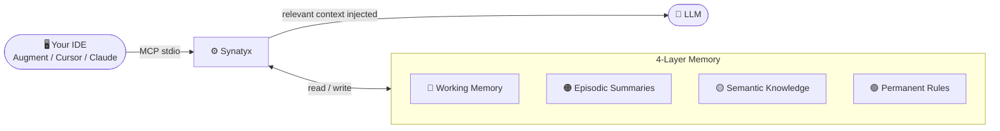

<div align="center">

# Synatyx

**The memory layer your AI agents have been missing.**

Give your LLM a persistent, structured, relevance-scored memory — that survives every conversation, every session, every project.

[](https://python.org)
[](LICENSE)
[](docs/mcp-tools.md)
[](docker-compose.yml)

</div>

---

## The Problem

LLMs are stateless. Every new conversation starts from zero — no memory of past decisions, preferences, or project context. You repeat yourself constantly. Your AI assistant forgets everything you taught it yesterday.

**Synatyx fixes that.**

---

## What It Does

Synatyx is a **Context Engine** that plugs into any MCP-compatible AI client (Augment Code, Cursor, Claude Desktop, Claude Code) and gives it persistent, structured memory across all your conversations.



Your AI now **remembers** what you decided last week, **recalls** how your codebase is structured, and **follows** your preferences without being told again.

---

## Why Synatyx

**🧠 Persistent memory across sessions**
Store facts, decisions, and context once — retrieve them forever. No more repeating yourself.

**🎯 Relevance-ranked retrieval**
Hybrid dense + BM25 + MMR pipeline surfaces the right memories, not just the newest ones. Empty results come back with diagnostics explaining why.

**📋 One-call session briefing**
`context_brief` composes identity, project knowledge, recent changes, failed attempts, and open tasks into a single token-budgeted digest.

**📦 Multi-project isolation**
Each project gets its own memory space. Switch projects, switch context — nothing bleeds over.

**🪝 Automatic session capture**
A SessionEnd hook posts a digest of every session to `/capture` — memory gets written even when the agent forgets to store anything.

**🧹 Self-maintaining memory**
File-hash staleness detection, type-aware TTL decay, and background consolidation that merges episodic noise into stable L3 facts.

**🔖 Checkpoints that never disappear**
Pin critical decisions as named snapshots. Deprecate when superseded — never permanently deleted.

**✅ Persistent task tracking**
Tasks survive across sessions. Your AI picks up where it left off.

**🤖 Agent skill registry**
Store, index, and RAG-search agent skill definitions. The right agent for the right task, automatically.

**🏭 Production-ready**
Docker Compose, Alembic migrations, health checks, audit log — ready to deploy.

---

## Works With

| Client | Integration |
|--------|------------|
| **Augment Code** | MCP stdio |
| **Cursor** | MCP stdio |
| **Claude Desktop** | MCP stdio |
| **Claude Code** | MCP stdio |
| Any MCP client | JSON-RPC 2.0 / stdio |

---

## Get Started

```bash
git clone https://github.com/tanerincode/synatyx.git && cd synatyx
cp .env.example .env   # add your EMBEDDING_OPENAI_API_KEY
make                   # starts everything + tails logs
```

→ **[Full Setup Guide](docs/local-setup.md)**

---

## Documentation

| Doc | What's inside |
|-----|--------------|
| [Local Setup](docs/local-setup.md) | Prerequisites, Docker, IDE config, Makefile reference, troubleshooting |
| [MCP Tools Reference](docs/mcp-tools.md) | All 27 tools — params, descriptions, examples |
| [Architecture](docs/architecture.md) | 4-layer memory model, retrieval pipeline, tech stack, project structure |
| [Memory Relations](docs/memory-relations.md) | Typed edges between memories — supersedes chains, retrieval expansion, schema |
| [Memory Visualization](docs/memory-visualization.md) | `context_visualize` — Mermaid memory graphs, legend, parameters |
| [Efficiency Improvements](docs/efficiency-improvements.md) | Batch store, direct get, parallel retrieval, reliability fixes |
| [Alternative Detection](docs/alternatives.md) | Auto-detecting memories that serve the same purpose — thresholds, `context_alternatives` |
| [Session Brief & Trust](docs/session-brief.md) | `context_brief` one-call startup digest, retrieval diagnostics, provenance origins, attempt records |
| [Automatic Capture](docs/automatic-capture.md) | `/capture` endpoint + Claude Code SessionEnd hook — memory writes without agent discipline |
| [Memory Hygiene](docs/memory-hygiene.md) | File-hash staleness flags, type-aware TTL decay, background L2→L3 consolidation |

---

## License

MIT © [Taner Tombas](https://github.com/tanerincode)

