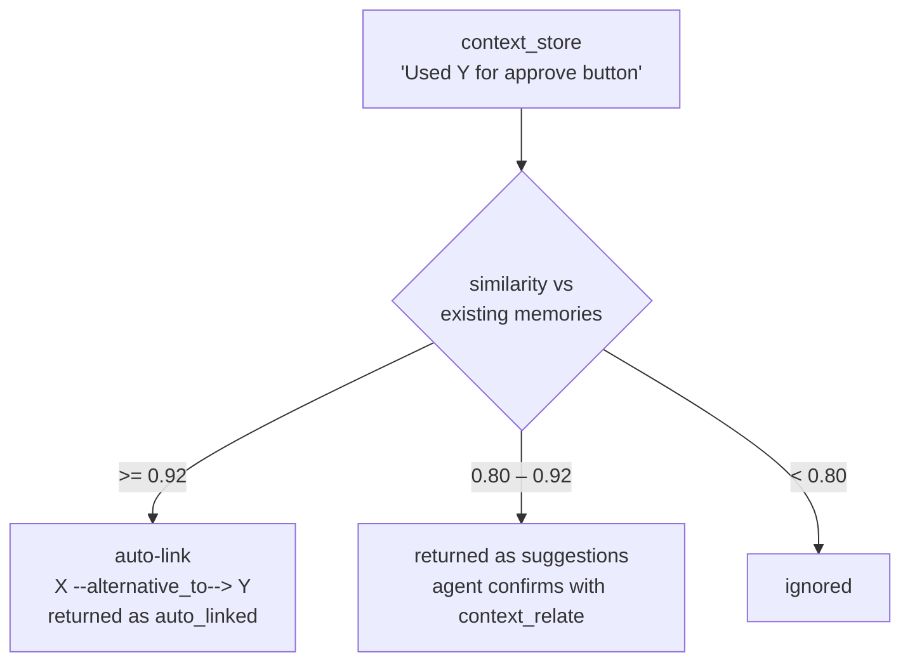

# Synatyx — Alternative Detection

*"You used component X for the approve button. You also used Y for an approve button. So: X and Y can both be used for approve buttons."*

Alternative detection makes that connection **automatically**. Whenever a memory is stored, Synatyx compares its embedding against existing memories; items serving the same purpose are linked (or suggested) as alternatives — so asking *"what can I use for an approve button?"* returns the full set of options, not just the closest single match.

---

## How It Works



Two similarity bands (thresholds configurable):

| Band | Default | Behavior |
|------|---------|----------|
| **Auto-link** | ≥ `0.92` | An `alternative_to` edge is created silently, with `{"auto": true, "similarity": …}` metadata. Reported in the store response under `auto_linked`. |
| **Suggest** | `0.80` – `0.92` | No edge is created. Candidates are returned under `suggestions` — the agent (Claude/Cursor) confirms the good ones with `context_relate`. |
| Below | < `0.80` | Nothing happens. |

Detection runs on every `context_store` (single and batch) for L2–L4. It never blocks or fails a store — errors are logged and swallowed. Items already related to the new memory are excluded, so re-storing related facts doesn't re-suggest known links.

### Store response with detections

```json
{
  "item_id": "…Y…",
  "embedded": true,
  "auto_linked": [
    { "item_id": "…X…", "content": "Used ApproveButton…", "similarity": 0.955, "relation_id": "…" }
  ],
  "suggestions": [
    { "item_id": "…Z…", "content": "GreenCheckButton experimental…", "similarity": 0.84 }
  ]
}
```

---

## Querying Alternatives

### `context_alternatives`

Ask by purpose — returns each matching memory grouped with its alternatives (neighbors via `alternative_to` or `used_for` edges):

| Param | Type | Required | Description |
|-------|------|----------|-------------|
| `user_id` | string | ✅ | User identifier |
| `query` | string | ✅ | The purpose, e.g. `"approve button component"` |
| `top_k` | integer | — | Max groups (default: 5) |

```json
{
  "query": "approve button component",
  "groups": [
    {
      "item": { "item_id": "…X…", "content": "ApproveButton from the design system", "similarity": 0.91 },
      "alternatives": [
        { "item_id": "…Y…", "content": "ConfirmActionButton legacy component", "relation_type": "alternative_to" }
      ]
    }
  ]
}
```

Groups with alternatives sort first. An item that appears as someone's alternative isn't duplicated as its own group. Deprecated items are skipped.

---

## Manual Grouping — Purpose Hubs

For explicit curation, the `used_for` relation type supports a hub-and-spoke pattern: store a memory representing the purpose itself ("Approve button UI"), then `context_relate` each component to it with `used_for`. `context_alternatives` and `context_related` traverse both `alternative_to` and `used_for` edges, and `context_visualize` shows the purpose clusters.

---

## Configuration

| Env var | Default | Meaning |
|---------|---------|---------|
| `RELATION_DETECT_ENABLED` | `true` | Turn detection off entirely |
| `RELATION_AUTOLINK_THRESHOLD` | `0.92` | Auto-link band floor |
| `RELATION_SUGGEST_THRESHOLD` | `0.80` | Suggestion band floor |
| `RELATION_DETECT_LIMIT` | `5` | Max detections per stored item |

> **Tuning note:** with OpenAI `text-embedding-3-small`, ≥ 0.92 usually means near-identical intent, safe to auto-link. If you see false auto-links (e.g. "approve button" vs "reject button" — texts that differ by one meaningful word can still score high), raise `RELATION_AUTOLINK_THRESHOLD` towards 0.95 and rely on the suggestion band instead. Wrong auto-links are cheap to undo: `context_unrelate` with the pair.

## Notes

- L1 memories are never scanned (they live in Redis, without stored embeddings).
- Edges created here are ordinary [memory relations](memory-relations.md): they show up in `context_related`, expand via `context_retrieve(expand_relations=true)`, render in `context_visualize`, and are cleaned up when GC hard-deletes an endpoint.
