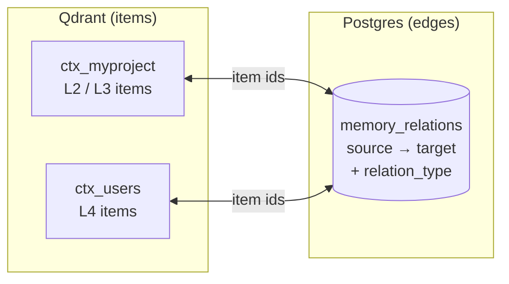

# Synatyx — Memory Relations

Memories used to be isolated fragments: retrieval could find them individually, but nothing captured that two facts belong together, that one decision replaced another, or that a bug was caused by a specific configuration. **Memory relations** add typed, directed edges between memory items, turning the store into a navigable knowledge graph.

---

## How It Works



- **Items stay in Qdrant** — one collection per project (`ctx_<slug>`), plus the shared `ctx_users` for L4.
- **Edges live in Postgres** — in the `memory_relations` table. Because every item id is a globally unique UUID, an edge can span collections: a project fact can link to a user-global L4 preference.
- Each edge is directed (`source → target`), typed, and deduplicated: the same `(user, source, target, type)` combination is stored only once — re-creating it returns the existing edge with `created: false`.
- Edges are user-isolated. Both endpoints must exist and belong to the calling user, verified on creation.

---

## Relation Types

| Type | Meaning | Example |
|------|---------|---------|
| `related_to` | General association (default) | "JWT auth decision" ↔ "user prefers stateless services" |
| `supersedes` | Source replaces target | "use RS256" supersedes "use HS256 shared secret" |
| `part_of` | Source is a component of target | "webhook retry policy" part_of "payments architecture" |
| `depends_on` | Source requires target | "key rotation cron" depends_on "keys stored in vault" |
| `caused_by` | Source resulted from target | "login outage postmortem" caused_by "expired TLS cert" |

Custom types are allowed — any string up to 64 chars. Types are normalized automatically (trimmed, lowercased, spaces/dashes → underscores), so `"Depends-On"` becomes `depends_on`. Self-links are rejected.

---

## Tools

### `context_relate`
Create an edge between two memories.

| Param | Type | Required | Description |
|-------|------|----------|-------------|
| `user_id` | string | ✅ | User identifier |
| `source_id` | string | ✅ | Item the edge starts from |
| `target_id` | string | ✅ | Item the edge points to |
| `relation_type` | string | — | Edge type (default: `related_to`) |
| `metadata` | object | — | Extra context stored on the edge |

Returns `{relation_id, source_id, target_id, relation_type, created}`.

### `context_unrelate`
Delete edge(s) — by relation id, or by source+target pair (optionally narrowed by type).

| Param | Type | Required | Description |
|-------|------|----------|-------------|
| `user_id` | string | ✅ | User identifier |
| `relation_id` | string | — | Exact edge to delete |
| `source_id` + `target_id` | string | — | Endpoint pair (alternative to `relation_id`) |
| `relation_type` | string | — | Only delete edges of this type |

### `context_related`
List the memories linked to an item, with the connecting edges. Neighbors are fetched by **direct point lookup**, not vector search — so deprecated items (e.g. the old side of a `supersedes` chain) are still visible.

| Param | Type | Required | Description |
|-------|------|----------|-------------|
| `user_id` | string | ✅ | User identifier |
| `item_id` | string | ✅ | Anchor item |
| `relation_type` | string | — | Only follow edges of this type |
| `direction` | string | — | `out`, `in`, or `both` (default) |

### `context_get`
Fetch one memory directly by id — checks the project collection first, then `ctx_users`. No vector search involved.

| Param | Type | Required | Description |
|-------|------|----------|-------------|
| `user_id` | string | ✅ | User identifier |
| `item_id` | string | ✅ | Item to fetch |

---

## Retrieval Expansion

`context_retrieve` accepts an opt-in flag:

```json
{ "user_id": "...", "query": "how do payments reach stripe", "expand_relations": true }
```

After the normal ranked results are assembled, Synatyx fetches their edges in one query and pulls in **1-hop neighbors** — deduplicated against the results, skipping deprecated items, and capped so expansion never dominates the response. Each expanded item carries a marker explaining why it appeared:

```json
"via_relation": {
  "relation_id": "…",
  "relation_type": "depends_on",
  "anchor_item_id": "…"
}
```

---

## The Supersedes Lifecycle

The recommended flow when a fact changes:

```
1. context_store        → new fact, returns new_item_id
2. context_deprecate    → item_id=<old>, superseded_by=<new_item_id>
```

`superseded_by` deprecates the old item **and** creates the `new → old` supersedes edge in one call. The old item disappears from search results, but the decision history stays navigable: `context_related` on the new item still surfaces what it replaced.

---

## Lifecycle & GC

- **Soft deprecation keeps edges** — intentionally, so supersedes chains remain traversable.
- **Hard deletion removes edges** — when GC permanently deletes an item, all edges referencing it are removed from Postgres in the same pass. No dangling edges.

## Schema

Table `memory_relations` (Alembic migration `a1c4e9f27b53`):

| Column | Notes |
|--------|-------|
| `id` | UUID primary key |
| `user_id` | Indexed; enforced on every operation |
| `source_item_id` / `target_item_id` | Indexed; Qdrant point ids (no FK — items live in Qdrant) |
| `relation_type` | Normalized string |
| `project` | Optional project tag, indexed |
| `metadata` | JSONB, default `{}` |
| `created_at` | Timestamptz |

Unique constraint: `(user_id, source_item_id, target_item_id, relation_type)`.
