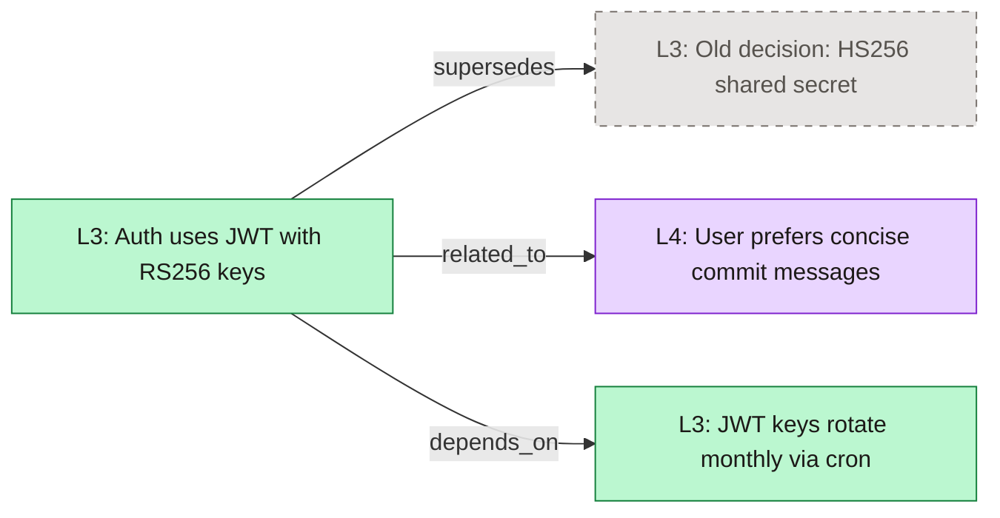

# Synatyx — Memory Visualization

`context_visualize` renders your memory graph — items plus their [relations](memory-relations.md) — as a **Mermaid flowchart**. The output is plain text that renders as a diagram anywhere Mermaid is supported: Claude (chat), Cursor, GitHub markdown, Notion, VS Code, or [mermaid.live](https://mermaid.live).

---

## Example

Asking Claude *"visualize my memories"* produces something like:

---

## Reading the Diagram

| Visual | Meaning |
|--------|---------|
| 🟡 Amber node | L1 — transient session note *(rarely shown, see limitations)* |
| 🔵 Blue node | L2 — episodic session summary |
| 🟢 Green node | L3 — semantic project knowledge |
| 🟣 Purple node | L4 — user-global preference |
| Dashed gray node | Deprecated item (e.g. the old side of a supersedes chain) |
| Thick border | Pinned item / checkpoint |
| Labeled arrow | Relation edge — label is the relation type |

---

## Tool Reference

### `context_visualize`

| Param | Type | Required | Description |
|-------|------|----------|-------------|
| `user_id` | string | ✅ | User identifier |
| `project` | string | — | Only items tagged with this project |
| `memory_layer` | string | — | `L1`–`L4`; filtering by `L4` reads the shared `ctx_users` collection |
| `relations_only` | boolean | — | Hide items with no edges (default: `false`) |
| `include_deprecated` | boolean | — | Show deprecated items (default: `true` — supersedes chains are usually the interesting part) |
| `direction` | string | — | `LR` (left-to-right, default) or `TD` (top-down) |
| `limit` | integer | — | Max items to include (default: 50) |

Returns `{mermaid, node_count, edge_count}`.

---

## How It Works

1. Items are listed from the active project's Qdrant collection (or `ctx_users` for an L4 filter).
2. All edges touching those items are fetched from Postgres in one query.
3. **External endpoints are hydrated**: if an edge points to an item outside the listed set — an L4 item in `ctx_users`, or a deprecated supersedes target — that endpoint is fetched by direct lookup and added to the graph, so edges never silently disappear.
4. The graph is rendered: node labels are the layer plus the first ~60 characters of content (sanitized for Mermaid), classes applied per layer, deprecated/pinned modifiers on top.

---

## Tips & Limitations

- **Readable up to ~50 nodes.** For bigger stores, narrow with `project`, `memory_layer`, or `relations_only: true`.
- **L1 never appears** — L1 lives only in Redis (working memory), not Qdrant, so the graph shows L2–L4.
- Node ids are derived from item UUIDs (`n_` + first 12 hex chars), so re-rendering the same data yields stable diagrams — useful for diffing over time.
- A nice workflow: generate the graph for a project after a milestone and paste it into the project docs as a living decision map.
